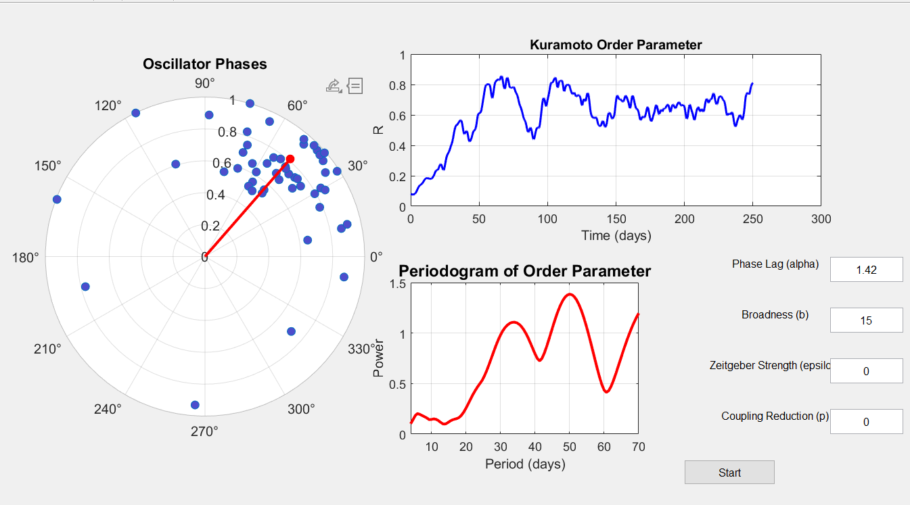

## 📂 Repository Structure  
This repository contains two main folders:  
- **`GUI/`** → The graphical user interface for interactive simulations.  
- **`manuscript/`** → MATLAB scripts used to **reproduce** the results from the manuscript:  
  _"Emerging multidien cycles from partial circadian synchrony"_.  


# Emerging_multidien_cycles manuscript

This folder contains the necessary scripts to perform a large-scale parameter sweep of the model presented in the paper **"Emerging multidien cycles from partial circadian synchrony."** These simulations are intended to be run on a computing cluster. Otherwise skip the sl code and directly simulate the matlab codes for specific parameters.

### Contents

- **`mainClusterChimerasAllparam.sl`**  
  A Slurm batch script for submitting the simulation job to a computing cluster. It handles the job scheduling and execution environment.

- **`mainClusterChimerasAllparam.m`**  
  The main MATLAB script that runs the full parameter exploration. It iterates over the desired range of model parameters and launches individual simulations using `ChimerasSimAllParam.m`.

- **`ChimerasSimAllParam.m`**  
  This script contains the simulation logic for the Kuramoto-Sakaguchi model with local coupling. It returns time series data, the Kuramoto order parameter, and other metrics for each parameter configuration.

- **`WaveletTransform.m`**  
  A utility function to compute the continuous wavelet transform (CWT) of the Kuramoto order parameter. Used to extract frequency content and identify multidien rhythms.

### How to Run

To run the parameter sweep on a cluster:
1. Edit the Slurm script (`mainClusterChimerasAllparam.sl`) to match your environment (e.g., paths, modules, job time, etc.).
2. Submit the job using:
   ```bash
   sbatch mainClusterChimerasAllparam.sl


# Kuramoto-Sakaguchi Model GUI  

A **MATLAB graphical user interface (GUI)** for simulating the **Kuramoto-Sakaguchi Model**, which describes phase synchronization in a network of coupled oscillators. This tool allows users to **interactively tune parameters** and **visualize oscillator dynamics** in real time.  
## Equation


## ✨ Features  
✅ **Dynamic Polar Plot**: Shows oscillators' phase positions with smooth animation.  
✅ **Kuramoto Order Parameter Plot**: Tracks system-wide synchronization over time.  
✅ **Periodogram (Frequency Spectrum Analysis)**: Computed at the **end** of the simulation.  
✅ **Interactive Controls**: Adjust model parameters in real-time:  
   - **α (Phase Lag)** – Controls phase shift in coupling.  
   - **b (Broadness)** – Defines the connectivity of the network of a squared kernel.  
   - **ε (Zeitgeber Strength)** – Strength of external forcing.  
   - **p (Coupling Reduction)** – Probability of randomly removing links.  

## 🖥️ GUI Layout  
- **Left Panel** → **Polar Plot** (oscillators' phase positions + mean vector arrow)  
- **Top-Right** → **Kuramoto Order Parameter** (tracks synchronization over time)  
- **Bottom-Right** → **Periodogram** (frequency spectrum at the end of the simulation)  
- **Right Panel** → **Parameter inputs & Start button**
  


## 🚀 How to Run  
1. Clone the repository:  
   ```bash
   git clone https://github.com/MGrauLeguia/Emerging_multidien_cycles.git
   cd Emerging_multidien_cycles

